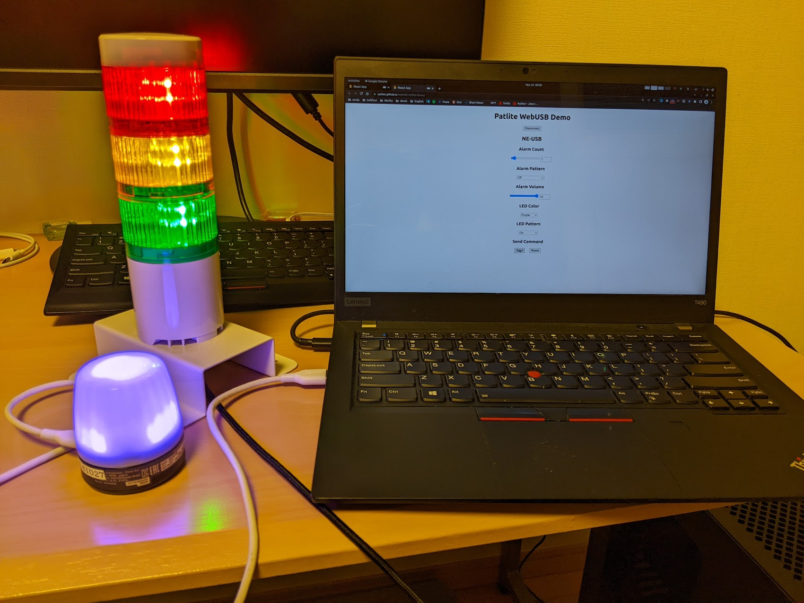

# WebHID Patlite Demo

Use Patlite USB devices on web browser



## Demo Page

https://syohex.github.io/WebHID-Patlite-Demo/

## Supported Devices

- [NE-USB](https://www.patlite.com/product/detail0000000762.html)
- [LR6-USB](https://www.patlite.com/product/detail0000000689.html)

## Supported Browser

- Windows Edge, Chrome
- macOS Chrome
- Linux Chrome

The browser must support [WebHID](https://wicg.github.io/webhid/).

## For Linux users

Add following udev rules(e.g. `/etc/udev/rules.d/90-patlite.rules`) to use USB devices without root permission.

```
# NE-USB
KERNEL=="hidraw*", SUBSYSTEM=="hidraw", ATTRS{idVendor}=="191a", ATTRS{idProduct}=="6001", MODE="0666"
# LR6-USB
KERNEL=="hidraw*", SUBSYSTEM=="hidraw", ATTRS{idVendor}=="191a", ATTRS{idProduct}=="8003", MODE="0666"
```

And then reload the rule by the following command

```
% sudo udevadm control --reload-rules
```

## How to use

1. Connect a device to PC
1. Open https://syohex.github.io/WebHID-Patlite-Demo/ in a web browser
1. Click connect button
1. Choose the device
1. Adjust parameters
1. Click send button
